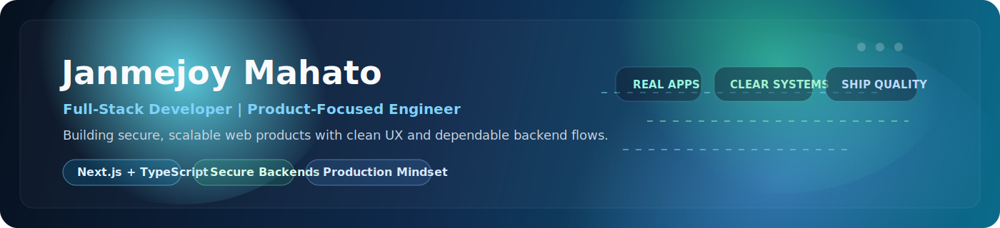
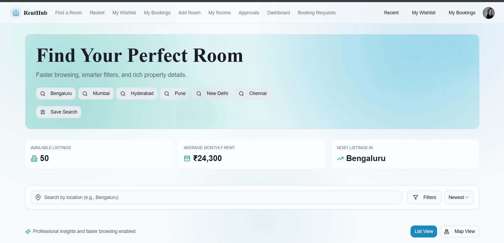
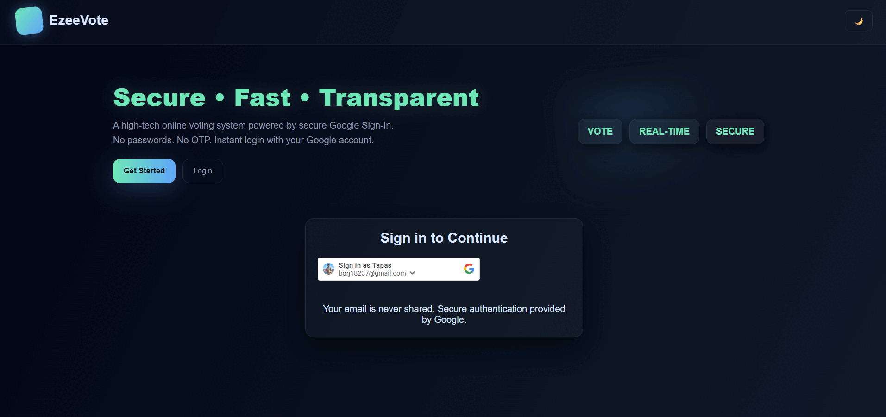

  

  

  
  
  
  
  

  
  
  

## &#128075; About

Full-stack developer building polished apps, secure flows, and production-minded systems. I like turning practical ideas into clean, usable products with strong frontend UX and dependable backend logic.

## &#127912; Stack

  

  
  
  

## &#127775; Featured Work

### &#127968; RentHub

Modern rental platform focused on search, comparison, and booking experience.

  
  

  

`Next.js 15` `TypeScript` `React 19` `Supabase`

### &#128499;&#65039; EzeeVote

Secure online voting system focused on verification, integrity, and admin control.

  
  

  

`Node.js` `Express` `SQLite` `JWT`

## &#127909; Gallery

| RentHub | EzeeVote |
| --- | --- |
|  |  |

## &#128200; GitHub

  
  

  

  

  

  
  

## &#128013; Snake

  <picture>
    <source media="(prefers-color-scheme: dark)" srcset="https://raw.githubusercontent.com/janmej0y/janmej0y/output/github-contribution-grid-snake-dark.svg" />
    
  </picture>

## &#10024; Extras

  
  
  

> "Programs must be written for people to read."
>
> "Simplicity is prerequisite for reliability."

  

  
  
  

  
  
  

  <a href="https://janmejoy.is-a.dev">Portfolio</a> |
  <a href="https://www.linkedin.com/in/janmej0y">LinkedIn</a> |
  <a href="mailto:janmejoymahato529@gmail.com">Email</a>

